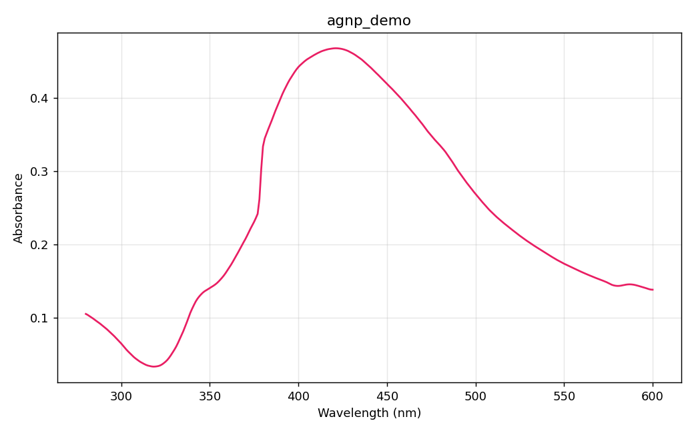
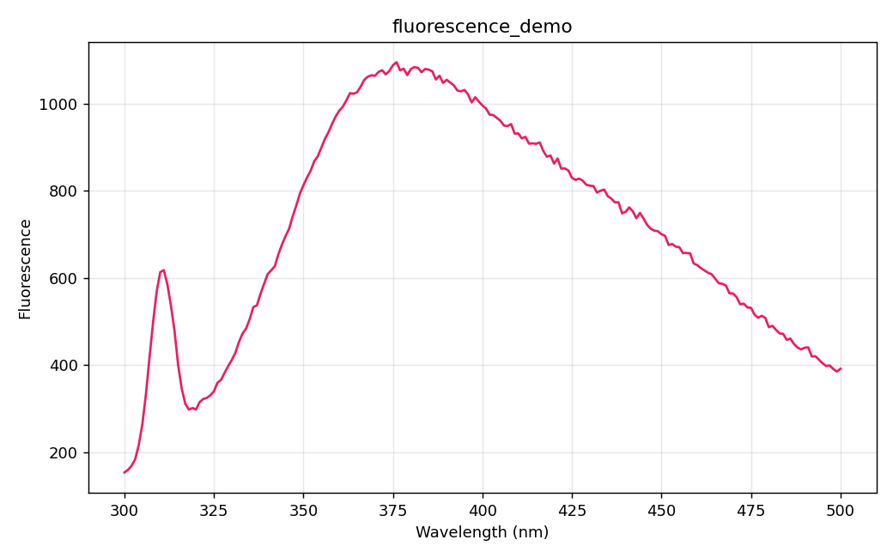

# spectrex

Convert proprietary Hitachi spectrophotometer `.UDS` and `.FDS` binary files to plain CSV (and quick-look PNG plots) on any PC, without the original 1995-era Windows software.

**📥 [Download `spectrex.exe` (no Python required)](https://github.com/tardigrade1001/spectrex/releases/latest)** for the standalone Windows build. Double-click it, choose a data folder, and follow the on-screen progress. Python users can run `spectrex.py` directly — see [Quick start](#quick-start).

| UV-Vis absorbance (`.UDS`) | Fluorescence emission (`.FDS`) |
|:---:|:---:|
|  |  |
| Silver nanoparticle plasmon peak ~420 nm | Emission spectrum (280 nm excitation) |

## The problem this solves

The Hitachi UV Solutions and FL Solutions programs save data in their own binary format by default. They offer a checkbox to also export a plain TXT file at save time. If that checkbox stays unticked, the resulting `.UDS`/`.FDS` files cannot be opened by anything else on your laptop.

The usual workaround is to physically go back to the instrument PC, open each file one at a time in the original software, and use its "export to TXT" command. This becomes painful when the instrument PC is busy, in another building, or running an old Windows version you would rather not touch.

This script reads those binary files directly. Users can now convert anywhere: their own laptop, a shared drive, a backup of old measurements, with no need to return to the instrument.

## Background

The instruments this targets:

- **Hitachi U-2900 Spectrophotometer**. UV-Vis absorbance, writes `.UDS` files. Controlled by *UV Solutions 4.2*.
- **Hitachi F-4600 FL Spectrophotometer**. Fluorescence, writes `.FDS` files. Controlled by *FL Solutions*.

Both are Windows 9x-era programs. The binary file formats are not publicly documented. The only built-in way to get data out is to open each file in the program and run its "export to TXT" command, one file at a time.

This tool reverse-engineers both formats and converts a whole tree of files in one pass.

## What it does

Pointed at a folder, `spectrex.py`:

1. Recursively finds every `.UDS` and `.FDS` file under it.
2. For each file:
   - Parses the binary header (sample name, timestamp, instrument, scan parameters).
   - Extracts the data array.
   - For UDS: converts the stored transmittance to absorbance (`A = -log₁₀ T`) and reverses the scan direction so the CSV is in ascending wavelength order.
   - For FDS: outputs the full 0.2 nm internal resolution.
   - Writes a CSV next to the original (same base name, `.csv` extension).
   - Writes a single-spectrum PNG next to it.
3. Generates two overlay PNGs in a `plots/` folder, one for all UDS spectra and one for all FDS, for quick cross-sample comparison.
4. Logs everything to `spectrex.log` in the root.

## Quick start

Requirements: Python 3.8+ and `matplotlib`.

```bash
pip install matplotlib
```

Double-click `spectrex.py` (or `spectrex.exe`) and either drag in a folder, drag in one or more `.UDS` / `.FDS` files, or use the **Browse** and **Choose files** buttons. The window shows live progress, clear completion counts, and any file-specific errors.

To run without the window, pass the data folder on the command line:

```bash
python spectrex.py "C:/path/to/data"
```

The repository includes a `samples/` folder with one UDS file and one FDS file, plus their original TXT exports for ground-truth comparison, so you can try the tool immediately:

```bash
python spectrex.py samples
```

Output looks like:

```
OK   Abs/AgNP - 04.03.UDS: UDS 321 pts 280-600 nm
OK   Abs/AgNP - 07.03.UDS: UDS 321 pts 280-600 nm
     note: 87/321 transmittance values are <=0 (very absorbing sample); absorbance set to NaN at those points
OK   FDS/230222_sample_280nm.FDS: FDS 1001 pts 300-500 nm
  -> plots/_overlay_uds.png
  -> plots/_overlay_fds.png

Done. 9 succeeded, 0 failed. Log: spectrex.log
```

Re-running the script regenerates everything. CSV and PNG outputs can be deleted at any time and rebuilt on the next run.

## Output format

Each CSV has a short comment header followed by the data. Acquisition parameters are extracted from the binary and emitted alongside the file metadata.

For UDS:

```
# Kind: UDS
# Sample: ANDI+ Fe3+
# Timestamp: 10:16:32, 03/10/2022
# Instrument: U-2900 Spectrophotometer  SN 2J15301 07  v 4.2
# Points: 321  Range: 280.00-600.00 nm
# Sampling step: 1.0 nm
# Slit width: 1.5 nm
# Scan speed: 800.0 nm/min
# Path length: 10.0 mm
# Lamp change wavelength: 340.0 nm
# Baseline correction: None
# Response setting: Medium
wavelength_nm,absorbance
280.00,0.1049
281.00,0.1036
...
```

For FDS:

```
# Kind: FDS
# Sample: ANDI + AL3+
# Timestamp: 12:07:49, 02/23/2022
# Operator: demo
# Instrument: F-4600 FL Spectrophotometer  SN 2967-002  v5J24000 02
# Points: 1001  Range: 300.00-500.00 nm
# Sampling step: 0.2 nm
# Excitation wavelength: 280.0 nm
# Note: FDS scan speed, slit widths, PMT voltage, response, and delay
#       are not currently extracted (appear encoded in the binary; see README).
wavelength_nm,fluorescence
300.00,154.1594
301.00,160.1994
...
```

Wavelengths are always ascending. The value column is `absorbance` for UDS and `fluorescence` for FDS.

### Note on FDS parameter extraction

UDS files store acquisition parameters as plain little-endian doubles in known offsets, so the full set (scan speed, slit width, path length, lamp change wavelength, baseline correction, response setting) is recovered. FDS files store some parameters in an encoded form that has not been mapped yet: scan speed, EX/EM slit widths, PMT voltage, response time, and delay. Differential analysis against multiple FDS files with varying parameters did not surface their offsets as plain doubles, suggesting they may be stored as setting codes or in a lookup-indexed format. These fields currently appear as a note in the FDS CSV header. Contributions are welcome.

## How the formats work

This is the part that matters if someone wants to extend the tool or write their own parser. Both formats use little-endian IEEE-754 doubles throughout.

### UDS (Hitachi U-2900, file extension `.UDS`)

```
offset  field                                     bytes
0       magic "IIHIITAG"                          8
8       (unknown / file id)                       8
16      sample name (null-terminated string)      var
        timestamp (null-terminated string)        var
        instrument model (null-terminated string) var
        serial number (null-terminated string)    var
        ROM version (null-terminated string)      var
        ... a few more parameter doubles ...
        slit width (double)                       8
        ...
        "None"  (baseline correction name)        var
        "Medium" (response setting)               var
        lamp_change_wavelength (double, e.g. 340) 8
        sampling_step (double, e.g. 1.0)          8
        start_wavelength (double, e.g. 600)       8
N+0     transmittance value 1 (double)            8     <- data starts
N+8     transmittance value 2                     8
...     (N values in scan order: high to low wavelength)
        footer sentinel (double, value 600.0)     8
        start_wavelength repeated (double)        8
        scan speed (double, e.g. 800)             8
        start_wavelength repeated (double)        8
        end_wavelength (double, e.g. 280)         8
        path length (double, e.g. 10.0)           8
        ... more metadata strings + reserved space ...
```

Key facts:

- The instrument stores **transmittance T**. The TXT export converts via `A = -log₁₀(T)`. We do the same.
- Data is stored in **scan order**. Scans run high to low wavelength, so `data[0]` corresponds to the start wavelength (the higher one). We reverse before writing the CSV.
- The end of the data array is detected by the sentinel value `600.0` that begins the footer. Any double with `abs(v) > 5` is out of the transmittance range and signals end of data.
- The header parameter triple is `[lamp_change_wl, step, start_wl]`. End wavelength is not stored in the header; it gets derived from data length × step.

### FDS (Hitachi F-4600, file extension `.FDS`)

```
offset  field                                     bytes
0       magic "IIHIDTAG"                          8
8       (unknown / file id)                       8
16      sample name (null-terminated string)      var
        operator (null-terminated string)         var
        timestamp (null-terminated string)        var
        ... reserved padding (00s or FFs) ...
anchor  "F-4600 FL Spectrophotometer\0"           var
        ROM version (null-terminated)             var
        serial number (null-terminated)           var
        storage_step (double, value 0.2)          8
        start_wavelength (double, e.g. 300)       8
D+0     record 0 (5 doubles)                      40    <- data starts
D+40    record 1 (5 doubles)                      40
...     (N records, each = 5 oversampled intensity values at 0.2 nm spacing)
F-32    excitation wavelength (double)            8
F-24    (mystery double, e.g. 430)                8
F-16    zeros                                     16
F+0     "Reagent 1\0Reagent 2\0..."               var
        ... filename string, more reserved space ...
```

Key facts:

- The instrument scans at **0.2 nm resolution internally**. Each 40-byte record holds 5 consecutive 0.2 nm samples.
- All 5 samples per record are written, giving full 0.2 nm resolution output.
- Data scans low to high wavelength (the natural direction).
- The end of data is located by searching for the `"Reagent 1\0"` ASCII marker. It sits 32 bytes after the last data record.
- The "F-4600" instrument string is also used as a search anchor. The padding between the run-info strings and the instrument-block strings varies in length and fill byte across files.

## Robustness

Within the constraints of the U-2900 + F-4600 + UV Solutions / FL Solutions system the tool was built for, it handles:

- Arbitrary sample names, operator names, timestamps, comments.
- Different wavelength ranges, step sizes (`0.1, 0.2, 0.5, 1.0, 2.0, 5.0 nm`), and point counts.
- Very absorbing samples where transmittance drops to zero or slightly negative. Those points become `NaN` in absorbance.
- Both scan directions (UDS high to low, FDS low to high).

Things that will break it (and what the error message will say):

- A different instrument (e.g., Hitachi F-2700, F-7000) producing files with a different magic or anchor → `unrecognized magic bytes` or `instrument anchor 'F-4600' not found`.
- A different software version that omits the `"Reagent 1\0"` footer marker → `footer marker 'Reagent 1\0' not found after data block`.
- An FDS file where storage_step is not ≈ 0.2 nm → `storage_step X outside expected range`.
- A UDS file with a step value outside the whitelist → `UDS data block not found`.

Every failure is tagged with the stage (`[parse]`, `[csv]`, `[png]`) and a human-readable reason. Unexpected exceptions also dump a Python traceback. Everything goes to both stdout and `spectrex.log`.

## Project layout

A typical run on a folder of data ends up looking like this:

```
your-data-folder/
├── spectrex.py
├── spectrex.log
├── plots/
│   ├── _overlay_uds.png
│   └── _overlay_fds.png
├── Abs/                    # (your folder structure: anything goes)
│   ├── sample1.UDS
│   ├── sample1.csv         # generated
│   ├── sample1.png         # generated
│   └── ...
└── FDS/
    ├── sample1_280nm.FDS
    ├── sample1_280nm.csv   # generated
    ├── sample1_280nm.png   # generated
    └── ...
```

The script does not care how your folders are organised. It just walks the tree.

## Customisation

A few knobs near the top of `spectrex.py`:

- Plot colour: the single-spectrum colour is `#e91e63` (pink). The overlay plot uses matplotlib's default colour cycle so each spectrum is distinguishable.

## Contributing

If you have UDS/FDS files from a related Hitachi instrument that this tool does not handle, the fastest path to support is to drop a sample file plus the matching TXT export (from the original program) into an issue. The TXT gives the ground truth needed to verify any new format variant.

---

## The Story Behind This

This started as a workflow frustration. Our lab's Hitachi instruments save data in their own binary format, with an optional checkbox to also emit a plain TXT file at save time. If that checkbox is missed, which happens often in practice, the data is effectively locked to the instrument PC. Only the original 1995-era software can open it.

For a long time the workaround was to physically return to the instrument, queue files in the original program, and export them one at a time. That is fine for one file. It is painful for a backlog of measurements, especially when the instrument PC is busy, in another building, or running a Windows version no one wants to touch.

The initial assumption was that cracking the format would require decompiling the original `.exe`. That turned out to be unnecessary. The binary formats use simple little-endian doubles with readable ASCII string headers, and the original program's own TXT export provided ground truth to verify against. A single afternoon of hex dumps and `struct.unpack_from` calls was enough to pin down both file formats.

The technical sequence:

1. **Hex-dumped the files.** Both formats start with an ASCII "magic": `IIHIITAG` for UDS, `IIHIDTAG` for FDS, followed by readable strings (sample name, timestamp, instrument model). That gave away the high-level layout.
2. **Spotted plausible doubles in the header.** Scanning the bytes after the strings, several 8-byte chunks decoded to round numbers (340.0, 1.0, 600.0). Those had to be scan parameters.
3. **Got TXT ground truth.** Exporting one file via the original software gave a definitive "this wavelength → this value" mapping to verify against.
4. **First wrong guess (UDS).** The three doubles were initially assumed to be `[start, step, end]`. The CSV looked plausible. The plot then appeared flipped, with wavelengths increasing where absorbance should be peaking and vice versa.
5. **Realised UDS stores transmittance.** Binary value 0.7278 at the first position did not match the TXT's 0.138. Trying `-log₁₀(0.7278) = 0.138` produced a match. This also revealed that the doubles were really `[lamp_change_wl, step, start_wl]`.
6. **Spotted the FDS oversampling.** First FDS values almost matched the TXT: `data[0] = 154.16` against `TXT[0] = 154.2`, then `data[1] = 154.31` against `TXT[1] = 160.2`. Checking every Nth value showed a clean match at stride 5: 5 internal samples per 1 nm TXT row. The `0.2` double sitting just before the data confirmed the storage step.
7. **Found stable end-of-data markers** by inspecting what came after the expected data range. UDS uses a `600.0` sentinel. FDS uses the literal string `"Reagent 1"` 32 bytes after the data block.
8. **Verified end-to-end** against the program's own TXT exports for every file in the test set. Max absolute difference: 0.0005 for absorbance (TXT's display precision), and ~0.5 for fluorescence intensity (also display precision).

### Follow-up: trying to recover the FDS acquisition parameters

The header extraction works cleanly for UDS. Every parameter visible in the program's TXT export (slit width, scan speed, path length, lamp change wavelength, baseline correction, response setting) is stored as a plain little-endian double at a fixed offset, so spectrex emits all of them in the CSV header.

FDS resisted the same treatment. Several acquisition parameters (scan speed, EX/EM slit widths, PMT voltage, response time, delay) do not appear in the FDS binary as their displayed values. To investigate, the following angles were tried:

1. **Differential analysis across an FDS archive** of ~300 files with mixed parameters. Files were paired so that everything matched except one knob (e.g., scan speed 1200 nm/min vs 240 nm/min, slits 5.0 nm vs 2.5 nm). Byte-level diffs of the binary pairs found only the comment field and embedded filename changing. No byte position tracked the parameter change as a plain double.

2. **Inspecting the FL Solutions installation directory**. The program ships with `.FLM` method templates (same `IIHIDTAG` magic as FDS, denser parameter block) and `flsol.MDB`, a Microsoft Access database. The FLM templates exposed a tightly packed parameter region, but the doubles in it were values like `211, 163, 13, 19, 103, 220, 9000` rather than the human-readable parameter values seen in TXT exports. These look like internal acquisition counters or setting indices.

3. **Reading the MDB**. The Access driver refused the file as "created with a previous version" (Jet 3.x / Access 97 era). A text-strings scan of the MDB found 99 strings total, none of which were parameter-table names. The MDB does not store the parameter lookup tables in plain text.

The conclusion is that FDS stores these parameters as **internal setting codes**, and the codes-to-human-readable-values mapping lives inside the program's DLLs (`flmethod.dll`, `flprop.dll`) as compiled tables. Extracting them would require disassembling the DLLs with a tool like Ghidra. That is a separate undertaking outside the scope of spectrex.

**This limitation does not affect the spectrum data itself.** The wavelength axis and intensity values for both UDS and FDS files are decoded exactly and verified byte-for-byte against the original program's TXT exports. The missing FDS fields are metadata about how the scan was acquired, not the scan data. Spectrex emits a note in the FDS CSV header listing which fields are not yet extracted, so anyone reading the output knows what is and is not available.

If you ever need those FDS acquisition parameters for a specific file, the simplest workaround is to re-export from FL Solutions with the "Save as TXT" checkbox ticked. The TXT will list every parameter the binary contains.

---

## Credits

The idea, requirements, lab knowledge, and direction came from me. The reverse-engineering and the Python code were produced collaboratively with [Claude](https://claude.ai) as an AI coding assistant across a single session. Verification at every step relied on TXT exports I generated from the original instrument software.

---

## License

MIT. Use it, fork it, share it.
